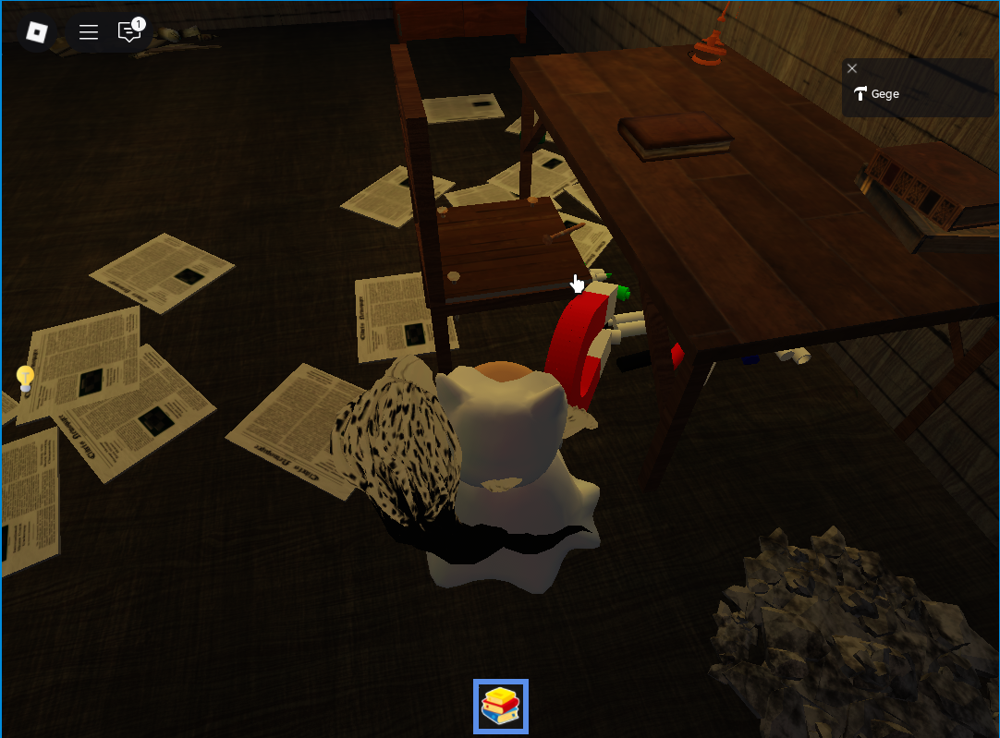
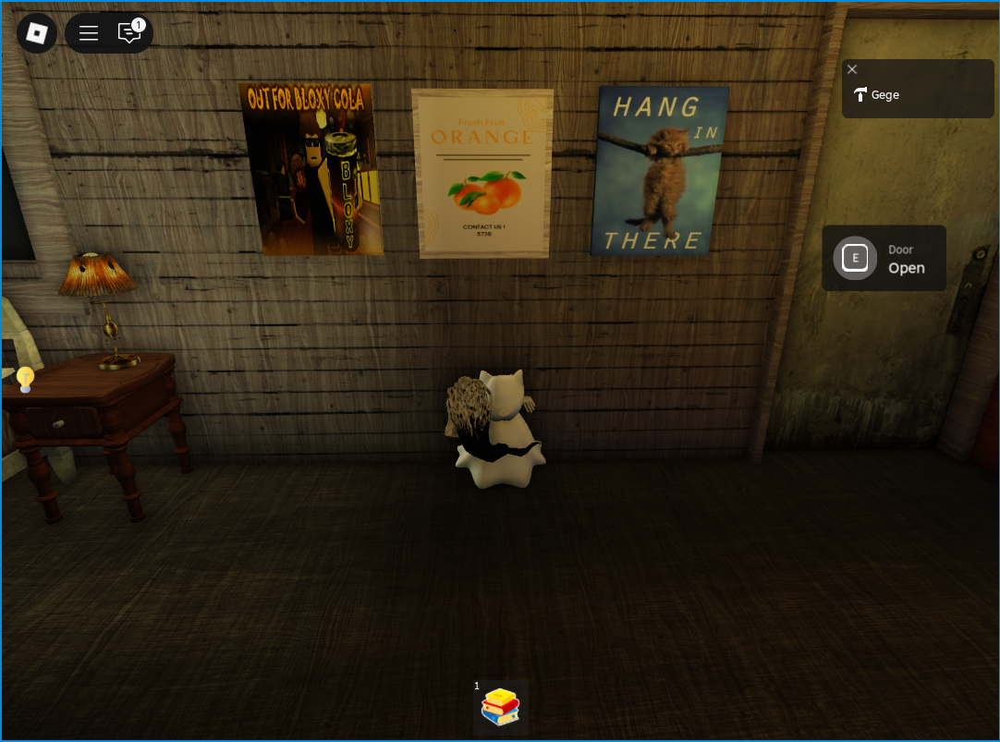
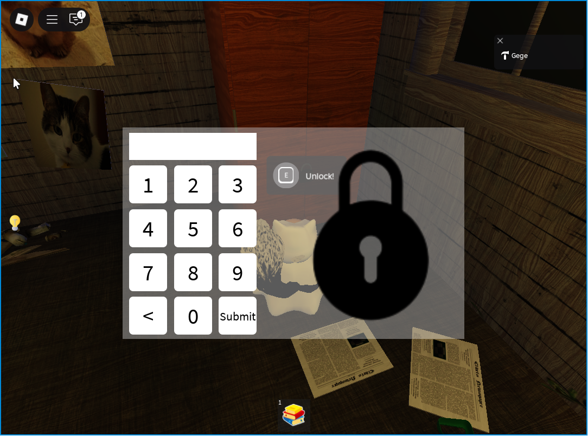
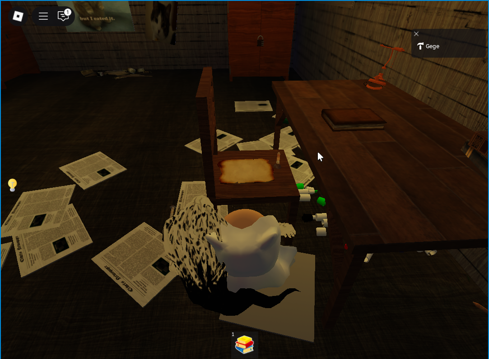
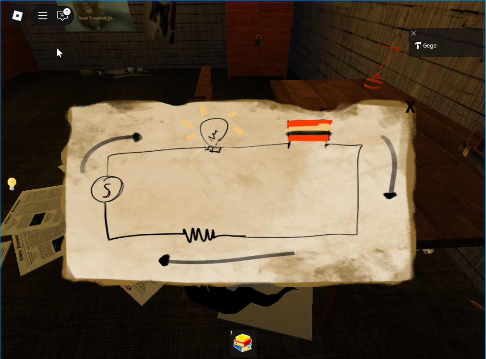
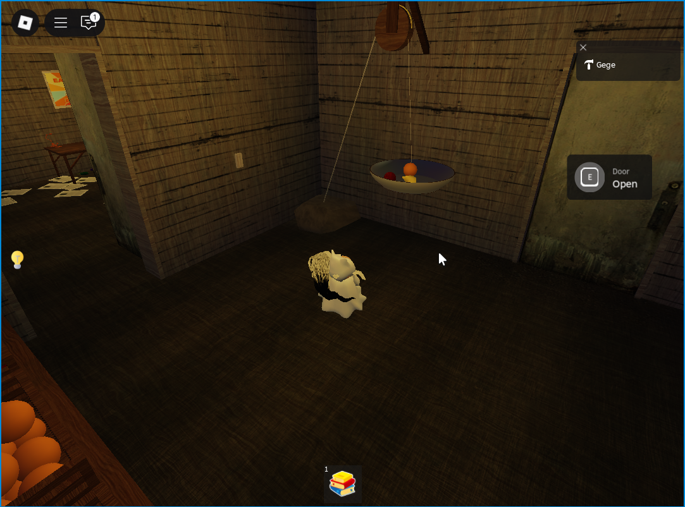
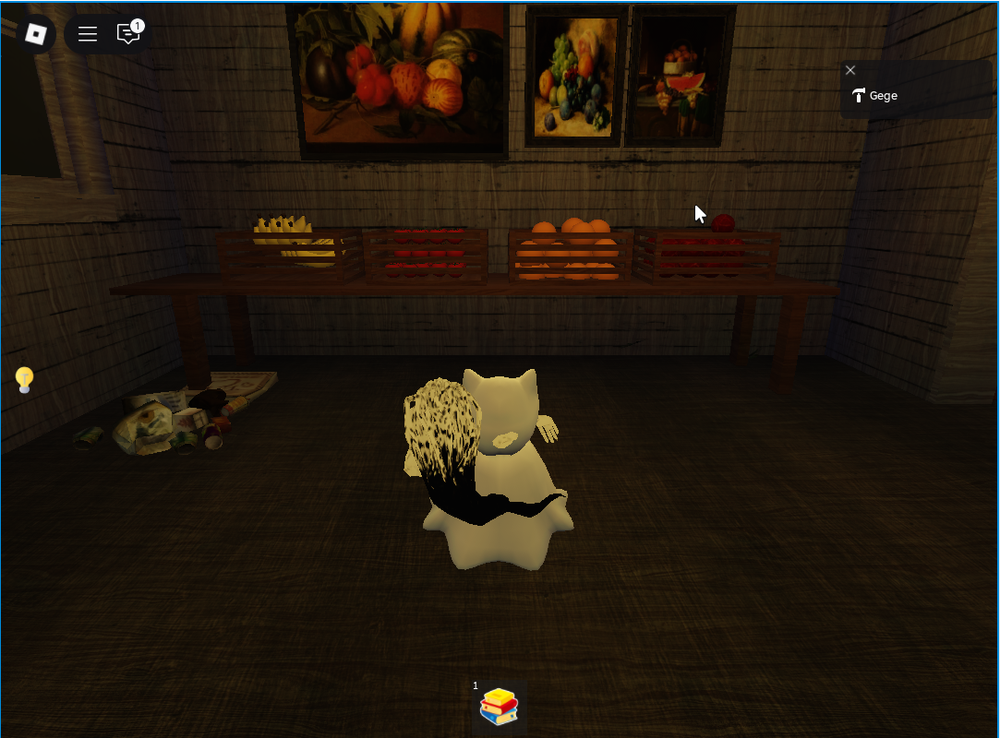

# 🔐 SciencEscape – Game Design Document

## 1. Game Overview
- **Genre**: Puzzle Adventure / Escape Room
- **Platform**: Roblox
- **Mode**: Singleplayer
- **Target Audience**: Players aged 10–15 who enjoy puzzle challenges based on observation, logic, and exploration.

### Main Concept
Players find themselves in a series of mysterious rooms filled with interactive puzzles.
Each puzzle is connected to a clue hidden in the environment. Players must observe, collect, and correctly use items to open the door to the next room.

---

## 2. Core Gameplay Loop
1. **Exploration** → Players observe the room and search for important objects.
2. **Interaction** → Players use items (e.g., a magnet to attract a nail).
3. **Clue Discovery** → Players find clues hidden on posters, walls, or objects.
4. **Puzzle Solving** → Players solve puzzles using logic (e.g., electrical circuits).
5. **Progression** → Completed puzzles open doors/access to the next room.
6. **Repeat** → Players advance to new puzzles with increasing difficulty.

---

## 3. Puzzle Design & Flow

### 🧲 Puzzle 1 – Magnet & Nail
- **Objective**: Use a magnet to remove the nail from the wall.
- **Clue**: Behind the board held in place by the nail is the first clue.
- **Asset**:

---

### 🖼️ Puzzle 2 – Poster Clue
- **Objective**: Observe the poster/photo on the wall.
- **Clue**: The poster has a hidden symbol/number that serves as the code for the cabinet.
- **Asset**:

---

### 🔒 Puzzle 3 – Locked Cabinet
- **Objective**: Use the code from the poster to open the cabinet.
- **Cupboard Contents**: The electrical circuit is incomplete.
- **Asset**:

---

### ⚡ Puzzle 4 – Electrical Circuit
- **Objective**: Arrange the wires/lights/resistors to connect the electricity.
- **Clue**: The basic schematic has been provided; the player must complete it.
- **Reward**: The door opens.
- **Asset**:

---

### ⚖️ Puzzle 5 – Pulley & Fruit
- **Objective**: Match the pulley weight to the available fruit.
- **Clue**: The poster in the previous room indicates the fruit weight combination.
- **Mechanics**: The player selects a fruit and places it on the pulley. If correct, the door opens.
- **Asset**:

---

## 4. Progression & Difficulty Curve
- Early puzzles (magnets & nails) → easy, focus on exploration.
- Middle puzzle (cupboard + electrical circuit) → intermediate, logic-focused.
- Final puzzle (pulley & fruit) → more complex, a combination of observation and calculation.

---

## 5. Tech & Implementation (Roblox Studio)
- **Scripting**: Lua (event handling for object interaction, UI for code, physics for pulley).
- **UI Elements**: Code input panel, feedback clue, electricity puzzle interface.
- **Environment**: Indoor escape-room style with mysterious lighting.
- **Multiplayer**: Optional, puzzles can be solved together.

---

## 6. Future Expansion
- New puzzles added to the next room.
- Randomized clues each session (different posters/numbers).
- Leaderboard for fastest puzzle completion times.
